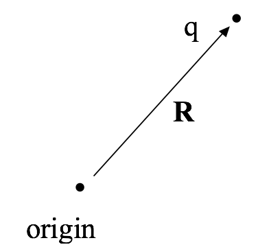
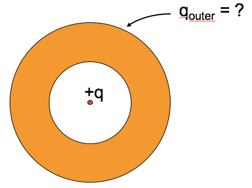

<section data-markdown>

What is the value of:

$$\int_{-\infty}^{\infty} x^2 \delta(x-2)dx$$

1. 0
2. 2
3. 4
4. $\infty$
5. Something else

Note:
* CORRECT ANSWER: C

</section>

<section data-markdown>
A point charge ($q$) is located at position $\mathbf{R}$, as shown. What is $\rho(\mathbf{r})$, the charge density in all space?

1. $\rho(\mathbf{r}) = q\delta^3(\mathbf{R})$
2. $\rho(\mathbf{r}) = q\delta^3(\mathbf{r})$
3. $\rho(\mathbf{r}) = q\delta^3(\mathbf{R}-\mathbf{r})$
4. $\rho(\mathbf{r}) = q\delta^3(\mathbf{r}-\mathbf{R})$
5. Something else??

Note:
* CORRECT ANSWER: E
* This one is a curious one because a delta function is always positive, both C and D are correct.
* Expect most everyone to pick C

</section>

<section data-markdown>

An electric dipole ($+q$ and $–q$, small distance $d$ apart) sits centered in a Gaussian sphere.

What can you say about the flux of $\mathbf{E}$ through the sphere, and $|\mathbf{E}|$ on the sphere?

1. Flux = 0, E = 0 everywhere on sphere surface
2. Flux = 0, E need not be zero *everywhere* on sphere
3. Flux is not zero, E = 0 everywhere on sphere
4. Flux is not zero, E need not be zero...

Note:
* CORRECT ANSWER: B
* Think about Q enclosed; what can we say about E though?

</section>

<section data-markdown>

Which of the following two fields has zero curl?

| I | II |
|:-:|:-:|
|  |  |

1. Both do.
2. Only I is zero
3. Only II is zero
4. Neither is zero
5. ???

Note:
* CORRECT ANSWER: C
* Think about paddle wheel
* Fall 2016: 9 0 [89] 3 0
</section>

<section data-markdown>

Can superposition be applied to electric potential, $V$?

$$V_{tot} \stackrel{?}{=} \sum_i V_i = V_1 +V_2 + V_3 + \dots$$

1. Yes
2. No
3. Sometimes

Note:
As long as the zero potential is the same for all measurements.

</section>

<section data-markdown>

Could this be a plot of $\left|\mathbf{E}(r)\right|$? Or $V(r)$? (for SOME physical situation?)

1. Could be $E(r)$, or $V(r)$
2. Could be $E(r)$, but can't be $V(r)$
3. Can't be $E(r)$, could be $V(r)$
4. Can't be either
5. ???

</section>

<section data-markdown>

A point charge $+q$ sits outside a **solid neutral conducting copper sphere** of radius $A$. The charge q is a distance $r > A$ from the center, on the right side. What is the E-field at the center of the sphere? (Assume equilibrium situation).

1. $|E| = kq/r^2$, to left
2. $kq/r^2 > |E| > 0$, to left
3. $|E| > 0$, to right
4. $E = 0$
5. None of these

Note:
* CORRECT ANSWER: D
* Net electric field inside of a metal in static equilibrium is zero
* Talk about the net field versus the field due to the charges on the metal.

</section>

<section data-markdown>

A neutral copper sphere has a spherical hollow in the center.  A charge $+q$ is placed in the center of the hollow.  What is the total charge on the outside surface of the copper sphere? (Assume Electrostatic equilibrium.)

1. Zero
2. $-q$
3. $+q$
4. $0 < q_{outer} < +q$
5. $-q < q_{outer} < 0$

</section>

<section data-markdown>

**True or False:** The electric field, $\mathbf{E(\mathbf{r})}$, in some region of space is zero, thus the electric potential, $V(\mathbf{r})$, in that same region of space is zero.

1. True
2. False

Note:
* CORRECT ANSWER: B
* The electric potential is a constant in the region; it might be zero, but doesn't have to be.

</section>

<section data-markdown>

**True or False:** The electric potential, $V(\mathbf{r})$, in some region of space is zero, thus the electric field, $\mathbf{E(\mathbf{r})}$, in that same region of space is zero.

1. True
2. False

Note:
* CORRECT ANSWER: A
* If the potential is zero in that space is zero, then it's gradient is zero in that space, so E must be zero also.

</section>

<section data-markdown>

The general solution for the electric potential in spherical coordinates with azimuthal symmetry (no $\phi$ dependence) is:

$$V(r,\theta) = \sum_{l=0}^{\infty} \left(A_l r^l + \dfrac{B_l}{r^{l+1}}\right)P_l(\cos \theta)$$

Consider a metal sphere (constant potential in and on the sphere, remember). Which terms in the sum vanish outside the sphere? (Recall: $V \rightarrow 0$ as $r \rightarrow \infty$)

1. All the $A_l$'s
2. All the $A_l$'s except $A_0$
3. All the $B_l$'s
4. All the $B_l$'s except $B_0$
5. Something else

Note:
* CORRECT ANSWER: E
* Only B0 will survive.

</section>

<section data-markdown>

$$\mathbf{p} = \sum_i q_i \mathbf{r}_i$$

What is the dipole moment of this system?

(BTW, it is NOT overall neutral!)

1. $q\mathbf{d}$
2. $2q\mathbf{d}$
3. $\frac{3}{2}q\mathbf{d}$
4. $3q\mathbf{d}$
5. Someting else (or not defined)

Note:
* CORRECT ANSWER: B

</section>

<section data-markdown>

You have a physical dipole, $+q$ and $-q$ a finite distance $d$ apart. When can you use the expression:

$$V(\mathbf{r}) = \dfrac{1}{4 \pi \varepsilon_0}\dfrac{\mathbf{p}\cdot \hat{\mathbf{r}}}{r^2}$$

1. This is an exact expression everywhere.
2. It's valid for large $r$
3. It's valid for small $r$
4. No idea...

Note:
* CORRECT ANSWER: B

</section>
