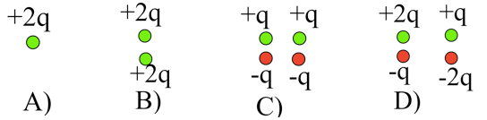
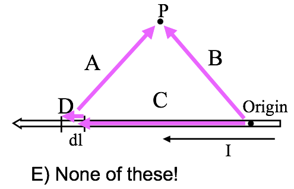
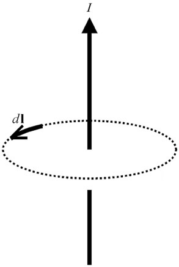

<section data-markdown>

You have a physical dipole, $+q$ and $-q$ a finite distance $d$ apart. When can you use the expression:

$$V(\mathbf{r}) = \dfrac{1}{4 \pi \varepsilon_0}\sum_i \dfrac{q_i}{\mathfrak{R}_i}$$

1. This is an exact expression everywhere.
2. It's valid for large $r$
3. It's valid for small $r$
4. No idea...

Note:
* CORRECT ANSWER: A

</section>

<section data-markdown>

## Announcements

* Homework 1 due today at 5pm (using gradescope.com)
  * Gradescope will let you turn in until Sunday at 5pm
  * Last two questions turn in on Github
* Quiz #1 - Next Friday
  * Last 25 minutes of class
  * No cheat sheets; all formulas will be provided
  * Solve a Gauss' Law Problem with spherical symmetry
  * Sketch a graph of the resulting electric field

</section>

<section data-markdown>

Which charge distributions below produce a potential that looks like $\frac{C}{r^2}$ when you are far away?

E) None of these, or more than one of these!

(For any which you did not select, how DO they behave at large r?)

Note:
* CORRECT ANSWER: E (Both C and D)

</section>

<section data-markdown>

A proton ($q=+e$) is released from rest in a uniform $\mathbf{E}$ and uniform $\mathbf{B}$.  $\mathbf{E}$ points up, $\mathbf{B}$ points into the page.  Which of the paths will the proton initially follow?

Note:
* CORRECT ANSWER: C
</section>

<section data-markdown>

A proton (speed $v$) enters a region of uniform $\mathbf{B}$. $v$ makes an angle $\theta$ with $\mathbf{B}$. What is the subsequent path of the proton?

1. Helical
2. Straight line
3. Circular motion, $\perp$ to page. (plane of circle is $\perp$ to $\mathbf{B}$)
4. Circular motion, $\perp$ to page. (plane of circle at angle $\theta$ w.r.t. $\mathbf{B}$)
5. Impossible.  $\mathbf{v}$ should always be $\perp$ to $\mathbf{B}$

Note:
* CORRECT ANSWER: A
</section>

<section data-markdown>

Current $I$ flows down a wire (length $L$) with a square cross section (side $a$). If it is uniformly distributed over the entire wire area, what is the magnitude of the volume current density $J$?

1. $J = I/a^2$
2. $J = I/a$
3. $J = I/4a$
4. $J = a^2I$
5. None of the above

Note:
* CORRECT ANSWER: A

</section>

<section data-markdown>

To find the magnetic field $\mathbf{B}$ at P due to a current-carrying wire we use the Biot-Savart law,
$$\mathbf{B}(\mathbf{r})  = \dfrac{\mu_0}{4\pi}I\int \dfrac{d\mathbf{l}\times\hat{\mathfrak{R}}}{\mathfrak{R}^2}$$
In the figure, with $d\mathbf{l}$ shown, which purple vector best represents $\mathfrak{R}$?

Note:
* CORRECT ANSWER: A

</section>

<section data-markdown>

What do you expect for direction of $\mathbf{B}(P)$? How about direction of $d\mathbf{B}(P)$ generated JUST by the segment of current $d\mathbf{l}$ in red?

1. $\mathbf{B}(P)$ in plane of page,  ditto for $d\mathbf{B}(P$, by red$)$
2. $\mathbf{B}(P)$ into page,  $d\mathbf{B}(P$, by red$)$ into page
3. $\mathbf{B}(P)$ into page,  $d\mathbf{B}(P$, by red$)$ out of page
4. $\mathbf{B}(P)$ complicated, ditto for $d\mathbf{B}(P$, by red$)$
5. Something else!!

Note:
* CORRECT ANSWER: C
</section>

<section data-markdown>

Consider the B-field a distance z from a current sheet (flowing in the +x-direction) in the z = 0 plane. The B-field has:

1. y-component only
2. z-component only
3. y and z-components
4. x, y, and z-components
5. Other

Note:
* CORRECT ANSWER: A

</section>

<section data-markdown>

Stoke's Theorem says that for a surface $S$ bounded by a perimeter $L$, any vector field $\mathbf{B}$ obeys:

$$\int_S (\nabla \times \mathbf{B}) \cdot dA = \oint_L \mathbf{B} \cdot d\mathbf{l}$$

Does Stoke's Theorem apply for any surface $S$ bounded by a perimeter $L$, even this balloon-shaped surface $S$?

1. Yes
2. No
3. Sometimes

Note:
* CORRECT ANSWER: A

</section>

<section data-markdown>

Much like Gauss's Law, Ampere's Law is always true (for magnetostatics), but only useful when there's sufficient symmetry to "pull B out" of the integral.

So we need to build an argument for what $\mathbf{B}$ looks like and what it can depend on.

For the case of an infinitely long wire, can $\mathbf{B}$ point radially (i.e., in the $\hat{s}$ direction)?

1. Yes
2. No
3. ???

Note:
* CORRECT ANSWER: B
* It violates Gauss's Law for B

</section>

<section data-markdown>

Continuing to build an argument for what $\mathbf{B}$ looks like and what it can depend on.

For the case of an infinitely long wire, can $\mathbf{B}$ depend on $z$ or $\phi$?

1. Yes
2. No
3. ???

Note:
* CORRECT ANSWER: B
* By symmetry it cannot

</section>

<section data-markdown>

Finalizing the argument for what $\mathbf{B}$ looks like and what it can depend on.

For the case of an infinitely long wire, can $\mathbf{B}$ have a $\hat{z}$ component?

1. Yes
2. No
3. ???

Note:
* CORRECT ANSWER: B
* Biot-Savart suggests it cannot

</section>

<section data-markdown>

Gauss' Law for magnetism, $\nabla \cdot \mathbf{B} = 0$ suggests we can generate a potential for $\mathbf{B}$. What form should the definition of this potential take ($\Phi$ and $\mathbf{A}$ are placeholder scalar and vector functions, respectively)?

1. $\mathbf{B} = \nabla \Phi$
2. $\mathbf{B} = \nabla \times \Phi$
3. $\mathbf{B} = \nabla \cdot \mathbf{A}$
4. $\mathbf{B} = \nabla \times \mathbf{A}$
5. Something else?!

Note:
* CORRECT ANSWER: D
</section>

<section data-markdown>

We can compute $\mathbf{A}$ using the following integral:

$\mathbf{A}(\mathbf{r}) = \dfrac{\mu_0}{4\pi}\int \dfrac{\mathbf{J}(\mathbf{r}')}{\mathfrak{R}}d\tau'$

Can you calculate that integral using spherical coordinates?

1. Yes, no problem
2. Yes, $r'$ can be in spherical, but $\mathbf{J}$ still needs to be in Cartesian components
3. No.

Note:
* CORRECT ANSWER: B
* It's subtle. Griffiths discusses this in a footnote, you can't solve for, say, the phi component of A by integrating the "phi component" of J (because the unit vectors in spherical coordinates themselves depend on position, and get differentiated by del squared too)

</section>

<section data-markdown>

Two magnetic dipoles $m_1$ and $m_2$ (equal in magnitude) are oriented in three different ways.

Which ways produce a dipole field at large distances?

1. None of these
2. All three
3. 1 only
4. 1 and 2 only
5. 1 and 3 only

Note:
* CORRECT ANSWER: E

</section>
