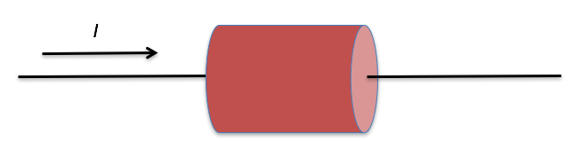
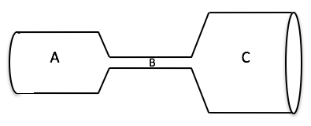
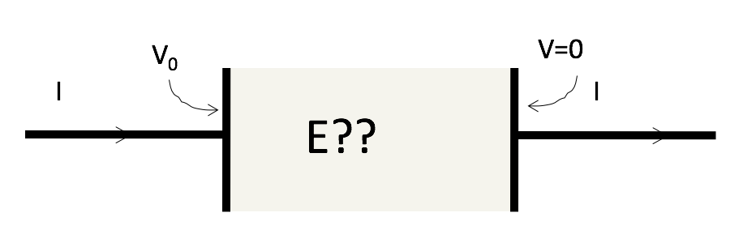

<section data-markdown>

In the interior of a metal in static equilibrium the charge density $\rho$ is:

1. zero always.
2. never zero.
3. sometimes zero, sometime non-zero, depending on the conditions.

Note:
* Correct Answer: A
</section>

<section data-markdown>

## Announcements

* Project homework is being graded (will finish tonight)
  * Use GitHub Desktop to sync for feedback
  * Quite a few empty repositories...
    * Please come see me ASAP if you need help with GitHub
* Homework 2 posted; due Friday

</section>

<section data-markdown>

## MOAR Announcements

* Quiz 1 on Friday (CU-WIP folks Thursday)
  * Last 20 minutes of class
  * No cheat sheets; all formulas will be provided
  * Solve a Gauss' Law Problem with spherical symmetry
  * Sketch a graph of the resulting electric field

* Help session starts this week
  * 3-5pm (6pm?) in Help Room (Strosacker Center)

</section>

<section data-markdown>

## Even MOAR

* Procedure for tunring in paper HW
  * Solve one problem per page(s) (full problem not parts)
  * Scan as Black and White PDF (photos vary in quality; mobile apps can do this)
  * We will grade at problem level (fewer uploads)

</section>

<section data-markdown>

Which of the following is a correct statement of charge conservation?

1. $\frac{dQ_{enc}}{dt} = -\int \mathbf{J}\cdot d\mathbf{l}$
2. $\frac{dQ_{enc}}{dt} = -\int \mathbf{J}\cdot d\mathbf{A}$
3. $\frac{dQ_{enc}}{dt} = -\int \nabla \cdot \mathbf{J}\,d\tau$
4. $\frac{dQ_{enc}}{dt} = -\nabla \cdot \mathbf{J}$
5. None of these or *more* than one of these

Note:
* Correct Answer: E (it's B and C; connected by divergence theorem)
</section>

<section data-markdown>

For everyday currents in home electronics and wires, which answer is the order of magnitude of the instantaneous speed of the electrons in the wire?

1. more than km/s
2. m/s
3. mm/s
4. $\mu$m/s
5. nm/s

Note:
* Correct Answer: A - using kT = 1/40 eV
</section>

<section data-markdown>

An electric current $I$ flows along a copper wire (low resistivity) into a resistor made of carbon (high resistivity) then back into another copper wire. In which material is the electric field largest?

1. In the copper wire
2. In the carbon resistor
3. It's the same in both copper and carbon
4. It depends on the sizes of the copper and carbon

Note:
* Correct Answer: D, normally B, but it will depend on the relative sizes (if the wire gets really small!)

</section>

<section data-markdown>

**Activity**: A copper cylinder is machined to have the following shape.  The ends are connected to a battery so that a current flows through the copper.

Rank order (from greatest to smallest, e.g. A=C>B)

Magnitude of E field, Conductivity, Current, & Current Density

</section>

<section data-markdown>

Inside this resistor setup, (real world, finite sizes!) What does the E field look like inside ?

1. Must be uniform and horizontal
2. Must have some nonuniformity, due to fringing effects!

</section>
