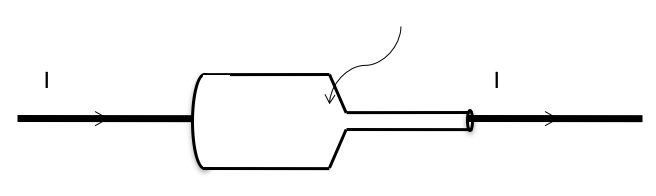
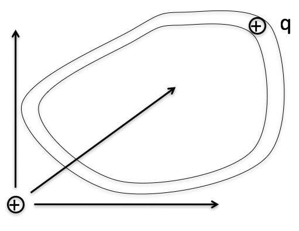
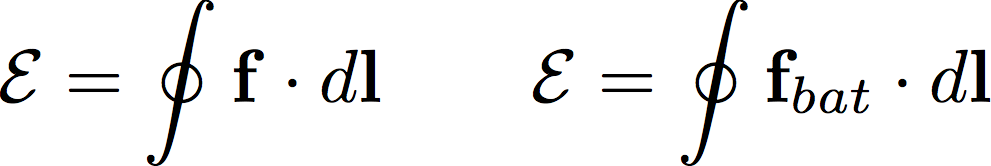
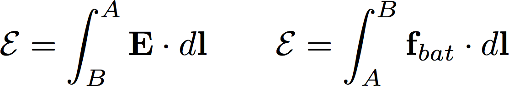

<section data-markdown>

Recall the machined copper from last class, with steady current flowing left to right through it

In steady state, do you expect there will be any surface charge accumulated anywhere on the walls of the conductor?

1. Yes
2. No

Note:
* Correct Answer: A

</section>

<section data-markdown>

$\mathcal{E} = \oint \mathbf{E} \cdot d\mathbf{l}$

EMF ($\mathcal{E}$) is the line integral of the total force per unit charge around a closed loop.
The units of EMF are:

1. Farads
2. Joules
3. Amps, (that’s why current flows.)
4. Newtons, (that’s why it’s called emf)
5. Something else

Note:
* Correct Answer: E; J/C = V

</section>

<section data-markdown>

Imagine a charge $q$ able to move around a tube which makes a closed loop. If we want to drive the charge around the loop, we **cannot** do this with E-field from a single stationary charge.

Can we drive the charge around the loop with some combination of stationary + and – charges?

1. Yes
2. No

Note:
* Correct Answer: B

</section>

<section data-markdown>

Consider a pure electrostatic electric field $\mathbf{E}_{es}$; in this case, the curl of the field vanishes (as we have seen before).

$$\nabla \times \mathbf{E}_{es} = 0$$

What is the $EMF$ associated with such a field over a closed loop?

$$\oint \mathbf{E}_{es} \cdot d\mathbf{l} = ??$$

1. Non-zero
2. Zero
2. Positive
4. Negative

Note:
* Correct Answer: B

</section>

<section data-markdown>

A circuit with a battery with voltage difference $\Delta V$ is attached to a resistor.  The force per charge due to the charges is $\mathbf{E}$.  The force per charge inside the battery is $\mathbf{f} = \mathbf{f}_{bat}  + \mathbf{E}$.

How many of the following statements are true?

A. 0 B. 1 C. 2 D. 3 E. 4

Note:
* Correct Answer: D

</section>
