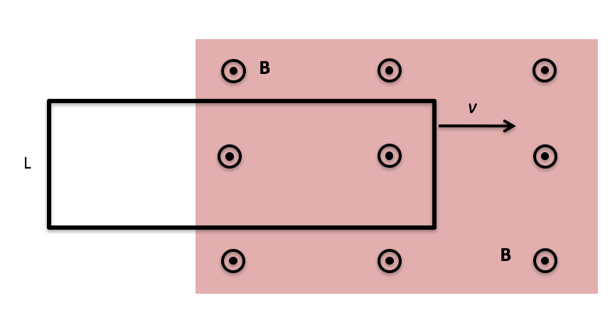
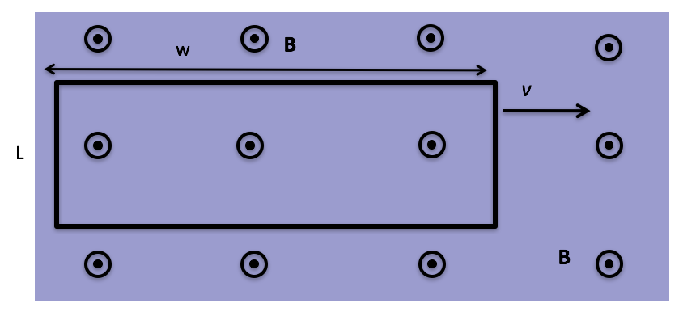

<section data-markdown>

In our basic model of a battery, we said that the force per unit charge the battery provides through chemical reactions ($\mathbf{f}$) had a magnitude equal the electric field produced by the separated charge ($\mathbf{E}$). This maintains a constant drift speed across the battery for the electrons.

If the battery has some internal resistance ($r$), which is larger?
1. $|\mathbf{f}|$
2. $|\mathbf{E}|$
3. Both still the same

Note:
Correct answer: A

</section>

<section data-markdown>

A metal bar moves with constant speed **to the right**. A constant magnetic field points **out of the page**. What happens to the electrons in the bar (in the frame of the moving bar)?

1. Nothing
2. They move upward
3. They move downward
4. They move left
5. They move right

Note:
* Correct Answer: B
</section>

<section data-markdown>

One end of rectangular metal loop enters a region of constant uniform magnetic field $\mathbf{B}$, with initial constant speed $v$, as shown.  What direction is the magnetic force on the loop?

1. Up the "screen" $\uparrow$
2. Down the "screen" $\downarrow$
3. To the right $\rightarrow$
4. To the left $\leftarrow$
5. The net force is zero

Note:
* Correct Answer: D
</section>

<section data-markdown>

One end of rectangular metal loop enters a region of constant uniform magnetic field $\mathbf{B}$, out of page, with constant speed $v$, as shown. As the loop enters the field is there a non-zero emf around the loop?

1. Yes, current will flow CW
2. Yes, current will flow CCW
3. No

Note:
* Correct Answer: A

</section>

<section data-markdown>

A rectangular metal loop moves through a region of constant uniform magnetic field $\mathbf{B}$, with speed $v$ at $t = 0$, as shown.  What is the magnetic force on the loop at the instant shown? Assume the loop has resistance $R$.

1. $2L^2 vB^2/R$ (right)
2. $2L^2 vB^2/R$  (left)
3. 0
4. Something else/not sure...

Note:
* Correct Answer: C
</section>
