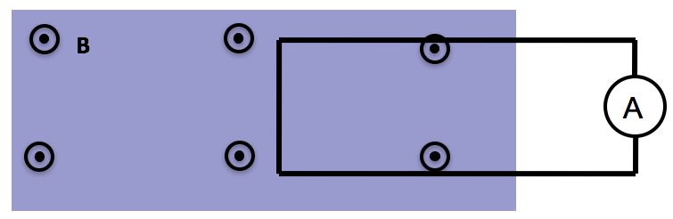
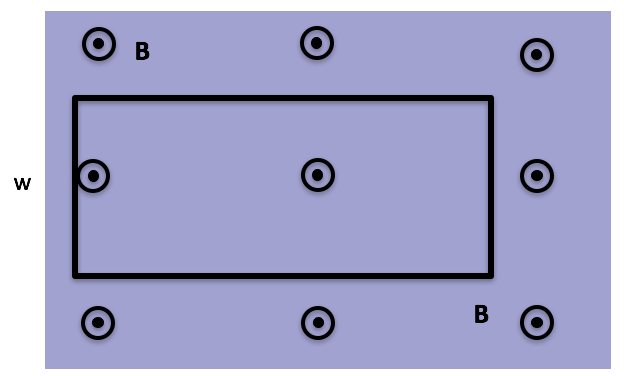
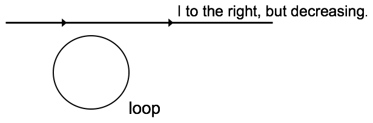
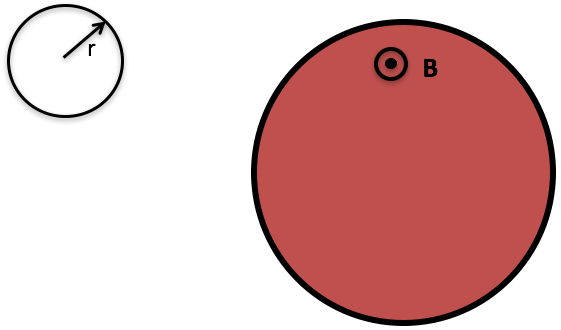

<section data-markdown>

Consider two situations: 

1) Loop moves to right with speed $\lvert v\rvert$ 

2) Magnetic field moves to left with (same) speed $\lvert v\rvert$ 

What will the ammeter read in each case? (Assume that CCW current => positive ammeter reading)

1. $I_1$>0, $I_2$=0
2. $I_1$= $I_2$ > 0
3. $I_1$= -$I_2$ > 0
4. $I_1$= $I_2$ = 0
5. Something different/not sure

Note:
* Correct Answer: B

</section>

<section data-markdown>

## Announcements

* Quiz 2 - Next Friday (Motional EMF)
  * Discuss the differences between:
    * $\mathcal{E} = \oint \mathbf{f} \cdot d\mathbf{l}$ and $\mathcal{E} = -\frac{d\Phi_B}{dt}$
  * Solve a motional EMF problem and discuss the direction of the current
* DC out of town (Jan 27 - 29)
  * Rachel Henderson will cover
</section>

<section data-markdown>

Faraday found that EMF is proportional to the negative time rate of change of B. EMF is also the line integral of a **force/charge**. The force is $\mathbf{f}_q$ in the expression:

$$\mathcal{E} = \oint \mathbf{f}_q \cdot d\mathbf{l}$$

That force is:

1. the magnetic Lorentz force.
2. an electric force.
3. the strong nuclear force.
4. the gravitational force.
5. an entirely new force.

Note:
* Correct Answer: B, but there's a subtlety here; could E (special relativity)

</section>

<section data-markdown>

A stationary rectangular metal loop is in a region of uniform magnetic field $\mathbf{B}$, which has magnitude B decreasing with time as $B=B_0-kt$. What is the direction of the field induced B-field created by the induced current in the loop, in the plane region inside the loop?

1. Into the screen
2. Out of the screen
3. To the left
4. To the right
5. other/??

Note:
* Correct Answer: B

</section>

<section data-markdown>

A rectangular metal loop is moving thru a region of constant uniform magnetic field $\mathbf{B}$, out of page, with constant speed $v$, as shown. Is there a non-zero emf around the loop?

1. Yes, current will flow CW
2. Yes, current will flow CCW
3. No

Note:
* Correct Answer: C

</section>

<section data-markdown>

A loop of wire is near a long straight wire which is carrying a large current $I$, which is **decreasing**.  The loop and the straight wire are in the same plane and are positioned as shown.  The current induced in the loop is:

1. counter-clockwise
2. clockwise
3. zero.

Note:
* Correct Answer: B

</section>

<section data-markdown>

The current in an infinite solenoid with uniform magnetic field $\mathbf{B}$ inside is increasing so that the magnitude $B$ in increasing with time as $B=B_0+kt$. A small circular loop of radius $r$ is placed outside the solenoid as shown.

What is the emf around the small loop? (Assume CW is the positive direction of current flow).

1. $k\pi r^2$
2. $-k\pi r^2$
3. Zero
4. Nonzero, but need more information for value
5. Not enough information to tell if zero or non-zero

Note:
* Correct Answer: C

</section>

<section data-markdown>

The current in an infinite solenoid with uniform magnetic field $\mathbf{B}$ inside is increasing so that the magnitude $B$ in increasing with time as $B=B_0+kt$. A small circular loop of radius $r$ is placed coaxially inside the solenoid as shown.  Without calculating anything, determine the direction of the induced magnetic field created by the induced current in the loop, in the plane region inside the loop?

1. Into the screen
2. Out of the screen
3. CW
4. CCW
5. Not enough information

Note:
* Correct Answer: A
</section>
