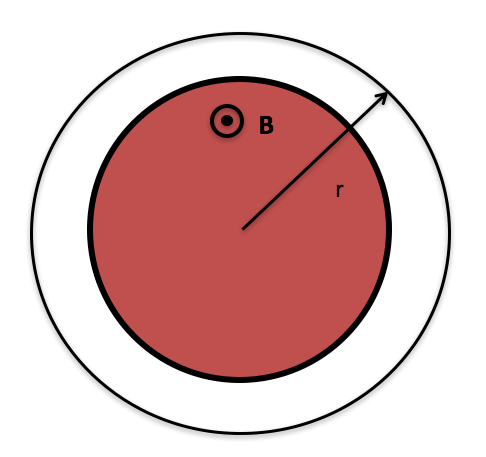
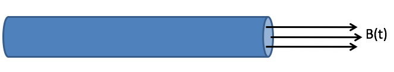
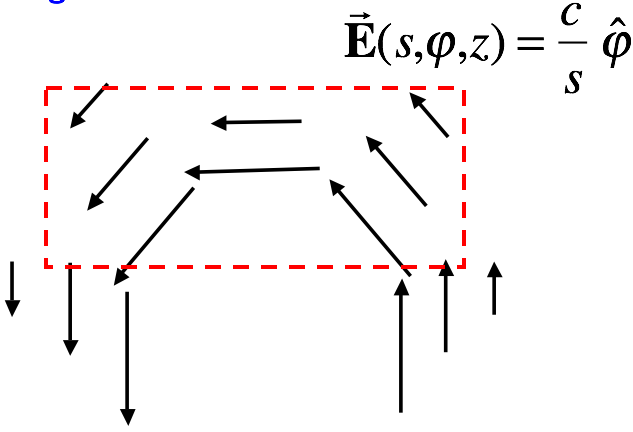
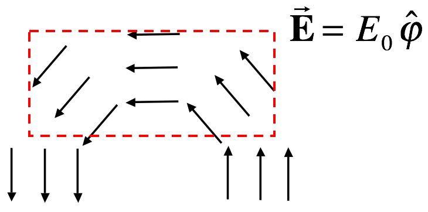

<section data-markdown>
## Announcements

* Quiz 2 - Next Friday (Motional EMF)
  * Discuss the differences between:
    * $\mathcal{E} = \oint \mathbf{f} \cdot d\mathbf{l}$ and $\mathcal{E} = -\frac{d\Phi_B}{dt}$
  * Solve a motional EMF problem and discuss the direction of the current
</section>

<section data-markdown>

The current in an infinite solenoid with uniform magnetic field $\mathbf{B}$ inside is increasing so that the magnitude B is increasing with time as $B=B_0+kt$. A circular loop of radius $r$ is placed coaxially outside the solenoid as shown.  In what direction is the induced $\mathbf{E}$ field around the loop?

1. CW
2. CCW
3. The induced E is zero
4. Not enough information

</section>

<section data-markdown>

The current in an infinite solenoid of radius $R$ with uniform magnetic field $\mathbf{B}$ inside is increasing so that the magnitude $B$ in increasing with time as $B=B_0+kt$.  If I calculate $V$ along path 1 and path 2 between points A and B, do I get the same answer?

1. Yes
2. No
3. Need more information

Note:
* Correct Answer: B
* My explanation involves going to the case with NO solenoid, where we know that the integral from A to B is path independent, and thus the loop integral all the way around is zero. So, A to B and B to A (the other path) CANCEL each other, making A to B and A to B (other path) EQUAL each other. That’s when the line integral IS zero. But now the line (loop) integral is NOT zero, and so those two integrals cannot still cancel.
</section>

<section data-markdown>

A long solenoid of cross sectional area, $A$, creates a magnetic field, $B_0(t)$ that is spatially uniform inside and zero outside the solenoid. SO:

1. $E=\dfrac{\mu_0 I}{2 \pi r}$
2. $E=-A\dfrac{\partial B}{\partial t}\dfrac{1}{\pi r^2}$
3. $E=-A2\pi r\dfrac{\partial B}{\partial t}$
4. $E=-A \dfrac{\partial B}{\partial t}\dfrac{1}{2 \pi r}$
5. Something else

Note:
* Correct Answer: D

</section>

<section data-markdown>

If the arrows represent an E field, is the rate of change in magnetic flux (perpendicular to the page) through the dashed region zero or nonzero?

1. $\frac{d\Phi}{dt} = 0$
2. $\frac{d\Phi}{dt} \neq 0$
3. ???

Note:
* Correct Answer: A
* Curl E is zero everywhere except at the origin! So, if our loop enclosed the origin, we'd be in trouble!

</section>

<section data-markdown>
If the arrows represent an E field (note that |E| is the same everywhere), is the rate of change in magnetic flux (perpendicular to the page) in the dashed region zero or nonzero?

1. $\frac{d\Phi}{dt} = 0$
2. $\frac{d\Phi}{dt} \neq 0$
3. Need more information

Note:
* Correct Answer: B

</section>
