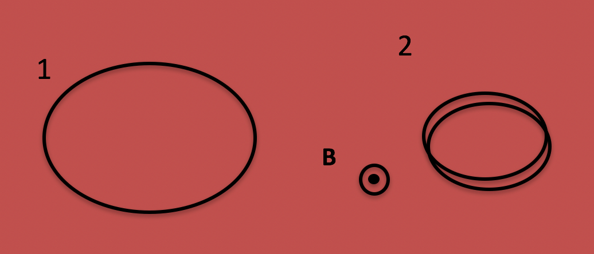
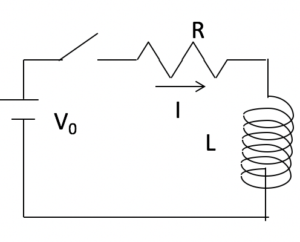

<section data-markdown>

Loop 1 sits in a uniform field B which is increasing in magnitude. Loop 2 has the SAME LENGTH OF WIRE looped (coiled) to make two (smaller) loops.
How do the induced EMFs compare?

1. EMF(1)=4 EMF(2)
2. EMF(1) = 2 EMF(2)
3. They are both the same.
4. EMF(2)= 4 EMF(1)
5. EMF(2) = 2 EMF(1)

Note:
* Correct Answer: B
* Reduce A by 4, Loops up by 2
</section>

<section data-markdown>

The switch is closed at $t=0$. What can you say about $I(t=0+)$?

1. Zero
2. $V_0/R$
3. $V_0/L$
4. Something else!
5. ???

Note:
* Correct Answer: B

</section>
