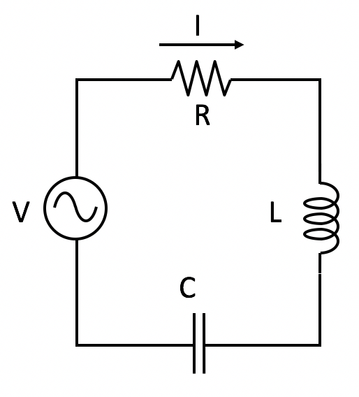

<section data-markdown>

What is $\vert 2+i \vert$?

1. $1$
2. $\sqrt{3}$
3. $5$
4. $\sqrt{5}$
5. Something else!

Note:
* Correct Answer: D
* Use pythagoras in the complex plane
</section>

<section data-markdown>

What is $(1+i)^2/(1-i)$?

1. $e^{i\pi/4}$
2. $\sqrt{2}e^{i\pi/4}$
3. $e^{i3\pi/4}$
4. $\sqrt{2}e^{i3\pi/4}$
5. Something else!

Note:
* Correct Answer: D
* Best to convert to euler with phase and just use the rules for adding and subtracting of exponents

</section>

<section data-markdown>

Which point below best represents $4e^{i3\pi/4}$ on the complex plane?

Note:
* Correct Answer: D

</section>

<section data-markdown>

What is $Re\left[\frac{e^{i\omega t}}{1+i}\right]$?

1. $\frac{1}{\sqrt{2}}\cos(\omega t + \pi/4)$
2. $\frac{1}{\sqrt{2}}\cos(\omega t - \pi/4)$
3. $\frac{1}{{2}}\cos(\omega t + \pi/4)$
4. $\frac{1}{{2}}\cos(\omega t - \pi/4)$
5. Something else

Note:
* Correct Answer: B

</section>

<section data-markdown>

A resistor ($R$) and an inductor ($L$) are in parallel. What is the effective impedance, $Z_{eff}$ across these elements?

1. $R + L$
2. $R + i\omega L$
3. $1/(R+i\omega L)$
4. $\dfrac{1}{1/R -i/(\omega L)}$
5. Something else?

Note:
* Correct Answer: D

</section>

<section data-markdown>

What is the total impedance of this circuit, $Z_{total}$?

1. $R + i\left(\omega L + \frac{1}{\omega C}\right)$
2. $R + i\left(\omega L - \frac{1}{\omega C}\right)$
3. $\frac{1}{R} + \frac{1}{i\omega L} + {i \omega C}$
4.  $\dfrac{1}{\frac{1}{R} + \frac{1}{i\omega L} + {i \omega C}}$
5. None of these

Note:
* Correct Answer: B

</section>

<section data-markdown>

AC voltage $V$ and current $I$ vs time $t$ are as shown:

The graph shows that..

1. $I$ leads $V$  ( $I$ peaks before $V$ peaks )
2. $I$ lags $V$    ( $I$ peaks after $V$ peaks )
3. Neither

Note:
* Correct Answer: B

</section>
