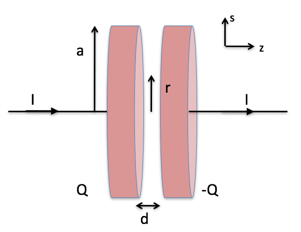
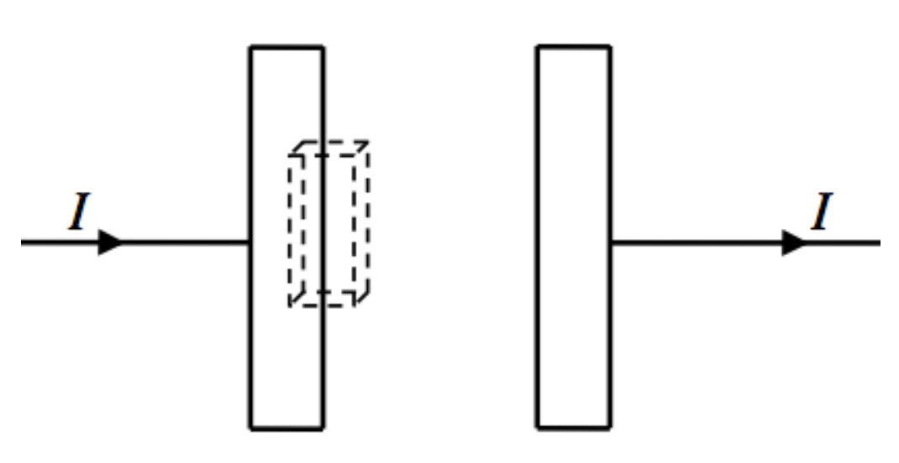
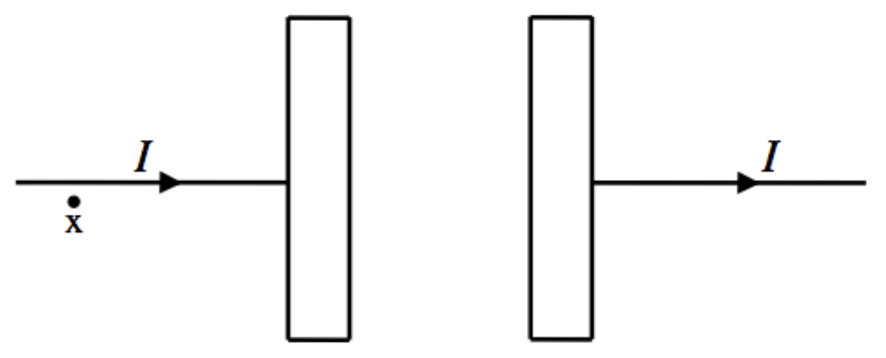
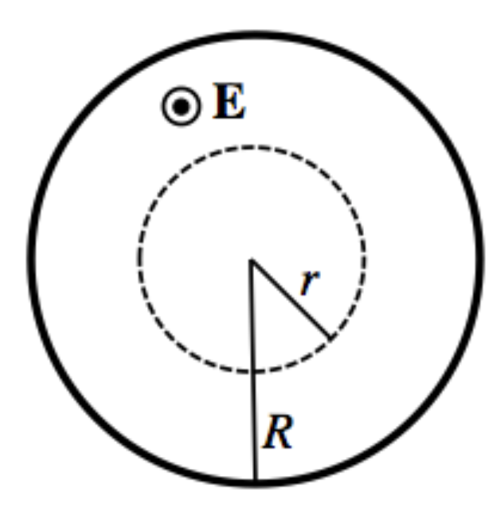

<section data-markdown>

Same capacitor with $Q = Q_0+\beta t$ on the positively charged plate. What is the magnitude of the magnetic field $\mathbf{B}$ halfway between the plates, at a radius $r$?

1. $\frac{\mu_0 \beta}{2 \pi r}$
2. $\frac{\mu_0 \beta r}{2 d^2}$
3. $\frac{\mu_0 \beta d}{2 a^2}$
4. $\frac{\mu_0 \beta a}{2 \pi r^2}$
5. None of the above

Note:
* Correct Answer: E

</section>

<section data-markdown>

Consider the surface of an imaginary volume (dashed lines, at right) that partly encloses the left capacitor plate. For this closed surface, is the total flux of the current density, $\iint \mathbf{J} \cdot d\mathbf{A}$ positive, negative or zero?

1. Positive
2. Negative
3. Zero

Note:
* Correct Answer: B
* The charge density is increasing, so the total charge in the region is increasing with time, thus the flux of the current density must be negative (conservation of charge).
</section>

<section data-markdown>

At each location, we will evaluate the sign of $\partial \rho/\partial t$ and $\nabla \cdot \mathbf{J}$.

**At location 3**, the signs of $\partial \rho/\partial t$ and $\nabla \cdot \mathbf{J}$ are:
1. both zero
2. both negative
3. both positive
4. $\partial \rho/\partial t$ is positive and $\nabla \cdot \mathbf{J}$ is negative
5. $\partial \rho/\partial t$ is negative and $\nabla \cdot \mathbf{J}$ is positive

*Recall that charge is conserved locally!*

Note:
* Correct Answer: A
* There is no current or charge inthe region

</section>

<section data-markdown>

At each location, we will evaluate the sign of $\partial \rho/\partial t$ and $\nabla \cdot \mathbf{J}$.

**At location 2**, the signs of $\partial \rho/\partial t$ and $\nabla \cdot \mathbf{J}$ are:
1. both zero
2. both negative
3. both positive
4. $\partial \rho/\partial t$ is positive and $\nabla \cdot \mathbf{J}$ is negative
5. $\partial \rho/\partial t$ is negative and $\nabla \cdot \mathbf{J}$ is positive

*Recall that charge is conserved locally!*

Note:
* Correct Answer: D
* One way to think about this is that the charge on the plate is increasing (so the density is increasingly more positive - positive charge). So the divergence of the current density is negative (jives with previous CQ also).

</section>

<section data-markdown>

At each location, we will evaluate the sign of $\partial \rho/\partial t$ and $\nabla \cdot \mathbf{J}$.

**At location 4**, the signs of $\partial \rho/\partial t$ and $\nabla \cdot \mathbf{J}$ are:
1. both zero
2. both negative
3. both positive
4. $\partial \rho/\partial t$ is positive and $\nabla \cdot \mathbf{J}$ is negative
5. $\partial \rho/\partial t$ is negative and $\nabla \cdot \mathbf{J}$ is positive

*Recall that charge is conserved locally!*

Note:
* Correct Answer: E
* One way to think about this is that the charge on the plate is increasing (so the density is increasingly more negative - negative charge). So the divergence of the current density is positive.

</section>

<section data-markdown>

At each location, we will evaluate the sign of $\partial \rho/\partial t$ and $\nabla \cdot \mathbf{J}$.

**At location 1**, the signs of $\partial \rho/\partial t$ and $\nabla \cdot \mathbf{J}$ are:
1. both zero
2. both negative
3. both positive
4. $\partial \rho/\partial t$ is positive and $\nabla \cdot \mathbf{J}$ is negative
5. $\partial \rho/\partial t$ is negative and $\nabla \cdot \mathbf{J}$ is positive

*Recall that charge is conserved locally!*

Note:
* Correct Answer: A
* The divergence of the curl of the magnetic field is zero and there's no electric field out there, so the divergence of J must vanish.

</section>

<section data-markdown>

At each location, we will evaluate the sign of $\partial \rho/\partial t$ and $\nabla \cdot \mathbf{J}$.

**At location 5**, the signs of $\partial \rho/\partial t$ and $\nabla \cdot \mathbf{J}$ are:
1. both zero
2. both negative
3. both positive
4. $\partial \rho/\partial t$ is positive and $\nabla \cdot \mathbf{J}$ is negative
5. $\partial \rho/\partial t$ is negative and $\nabla \cdot \mathbf{J}$ is positive

*Recall that charge is conserved locally!*

Note:
* Correct Answer: A
* The divergence of the curl of the magnetic field is zero and there's no electric field out there, so the divergence of J must vanish.

</section>

<section data-markdown>

Suppose the original Ampere's law $\nabla \times \mathbf{B} = \mu_0\mathbf{J}$ were correct without any correction from Maxwell (it’s not, but suppose for a moment that it is). What would this imply about $\nabla \cdot \mathbf{J}$ at points 2 and 4 in the diagram?

1. The remain unchanged
2. They swap signs
3. They become zero
4. ???

Note:
* Correct Answer: C

</section>

<section data-markdown>

Let's continue with the (incomplete) definition of Ampere's Law: $\nabla \times \mathbf{B} = \mu_0\mathbf{J}$.

What does this form tell you about the signs of $(\nabla \times \mathbf{B})_x$ at locations 1, 3, and 5?

1. All positive
2. All negative
3. Positive at 1 and 5, zero at 3
4. Negative at 1 and 5, zero at 3
5. Something else

Note:
* Correct Answer: C
* All we need here is the direction of Jx, which is zero at 3
</section>

<section data-markdown>

Let's return to the complete definition of Ampere's Law: $\nabla \times \mathbf{B} = \mu_0\mathbf{J} + \varepsilon_0 \mu_0 \frac{d\mathbf{E}}{dt}$.

**At location 1**, what are the signs of $J_x$, $dE_x/dt$, and $(\nabla \times \mathbf{B})_x$?

1. $J_x<0$, $dE_x/dt<0$, $(\nabla \times \mathbf{B})_x<0$
2. $J_x=0$, $dE_x/dt>0$, $(\nabla \times \mathbf{B})_x>0$
3. $J_x>0$, $dE_x/dt=0$, $(\nabla \times \mathbf{B})_x>0$
4. $J_x>0$, $dE_x/dt>0$, $(\nabla \times \mathbf{B})_x>0$
5. Something else

Note:
* Correct Answer: C
* There's no E there, Jx points to the right
</section>

<section data-markdown>

Let's return to the complete definition of Ampere's Law: $\nabla \times \mathbf{B} = \mu_0\mathbf{J} + \varepsilon_0 \mu_0 \frac{d\mathbf{E}}{dt}$.

**At location 3**, what are the signs of $J_x$, $dE_x/dt$, and $(\nabla \times \mathbf{B})_x$?

1. $J_x<0$, $dE_x/dt<0$, $(\nabla \times \mathbf{B})_x<0$
2. $J_x=0$, $dE_x/dt>0$, $(\nabla \times \mathbf{B})_x>0$
3. $J_x>0$, $dE_x/dt=0$, $(\nabla \times \mathbf{B})_x>0$
4. $J_x>0$, $dE_x/dt>0$, $(\nabla \times \mathbf{B})_x>0$
5. Something else

Note:
* Correct Answer: B
* There's no Jx there, Ex points to the right
</section>

<section data-markdown>

A pair of capacitor plates are charging up due to a current $I$. The plates have an area $A=\pi R^2$. Use the Maxwell-Ampere Law to find the magnetic field at the point "x" in the diagram as distance $r$ from the wire.

1. $B = \frac{\mu_0 I}{4 \pi r}$
2. $B = \frac{\mu_0 I}{2 \pi r}$
3. $B = \frac{\mu_0 I}{4 \pi r^2}$
4. $B = \frac{\mu_0 I}{2 \pi r^2}$
5. Something much more complicated

Note:
* Correct Answer: B

</section>

<section data-markdown>

The plates have an area $A=\pi R^2$. Use the Gauss' Law to find the electric field between the plates, answer in terms of $\sigma$ the charge density on the plates.

1. $E = \sigma/\varepsilon_0$
2. $E = -\sigma/\varepsilon_0$
3. $E = \sigma/(\varepsilon_0 \pi R^2)$
4. $E = \sigma \pi R^2 / \varepsilon_0$
5. Something much more complicated

Note:
* Correct Answer: B

</section>

<section data-markdown>

The plates have an area $A=\pi R^2$. Determine the relationship between the current flowing in the wires and the rate of change of the charge density on the plates.

1. $d\sigma/dt = I$
2. $\pi R^2 d\sigma/dt = I$
3. $d\sigma/dt = \pi R^2 I$
4. Something else

Note:
* Correct Answer: B

</section>

<section data-markdown>

We found the relationship between the current and the change of the charge density was: $\pi R^2 d\sigma/dt = I$. Determine the rate of change of the electric field between the plates, $d\mathbf{E}/dt$.

1. $\sigma/\varepsilon_0 \hat{x}$
2. $I/(\pi R^2 \varepsilon_0) \hat{x}$
3. $-I/(\pi R^2 \varepsilon_0) \hat{x}$
4. $I/(2 \pi R \varepsilon_0) \hat{x}$
5. $-I/(2 \pi R \varepsilon_0) \hat{x}$

Note:
* Correct Answer: B

</section>

<section data-markdown>

Use the Maxwell-Ampere Law to derive a formula for the manetic at a distance $r<R$ from the center of the plate in terms of the current, $I$.

1. $B=\frac{\mu_0 I}{2\pi r}$
2. $B=\frac{\mu_0 I r}{2\pi R^2}$
3. $B=\frac{\mu_0 I}{4\pi r}$
4. $B=\frac{\mu_0 I r}{4\pi R^2}$
5. Something else entirely

Note:
* Correct Answer: B

</section>

<section data-markdown>

Use the Maxwell-Ampere Law to derive a formula for the magnetic at a distance $r>R$ from the center of the plate in terms of the current, $I$.

1. $B=\frac{\mu_0 I}{2\pi r}$
2. $B=\frac{\mu_0 I r}{2\pi R^2}$
3. 0
5. Something else entirely

Note:
* Correct Answer: A

</section>
