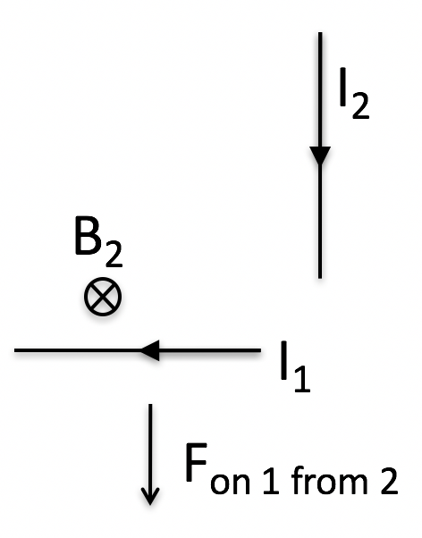
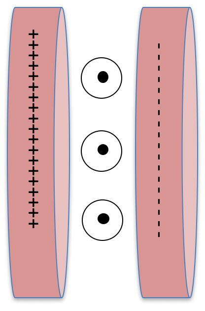
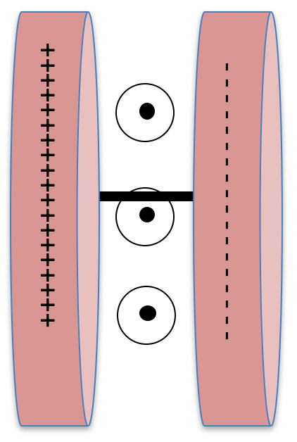

<section data-markdown>

Two short lengths of wire carry currents as shown. (The current is supplied by discharging a capacitor.) The diagram shows the direction of the force on wire 1 due to wire 2.

What is the direction of the force on wire 2 due to wire 1?
1. Right
2. Left
3. Up
4. Down

Note:
* Correct Answer: A

</section>

<section data-markdown>

Consider a charged capacitor placed in a uniform B field
in the $+y$ direction. $z$ points along the capacitor axis, so that $x$ points upward.

Which way does the stored field momentum in this system point?

1. $\pm \hat{x}$
2. $\pm \hat{y}$
3. $\pm \hat{z}$
4. Zero!

Note:
* Correct Answer: A

</section>

<section data-markdown>

Now "short out" this capacitor with a small wire.
As the current flows, (while the capacitor is discharging)...

which way does the magnetic force
push the wire (and thus, the system)?

1. $\pm \hat{x}$
2. $\pm \hat{y}$
3. $\pm \hat{z}$
4. Zero!

Note:
* Correct Answer: A

</section>

<section data-markdown>

Feynman’s Paradox:
Two charged balls are attached to a horizontal ring that can rotate  about a vertical axis without friction.  A solenoid with current I is on the axis.  Initially, everything is at rest.

The current in the solenoid is turned off. What is the direction of the induced $\mathbf{E}$ when viewed from the top?

1. 0
2. CW.
3. CCW.

Note:
* Correct Answer: B
</section>

<section data-markdown>

Feynman’s Paradox:
Two charged balls are attached to a horizontal ring that can rotate  about a vertical axis without friction.  A solenoid with current I is on the axis.  Initially, everything is at rest.

The current in the solenoid is turned off.
What happens to the charges?

1. They remain at rest
2. They rotate CW.
3. They rotate CCW.

Note:
* Correct Answer: B
</section>

<section data-markdown>

Does the Feynman device violate Conservation of Angular Momentum?

1. Yes
2. No
3. Neither, Cons of Ang Mom does not apply in this case.

Note:
* Correct Answer: B
</section>

<section data-markdown>

A function, $f(x,t)$, satisfies this PDE:

$$\dfrac{\partial^2 f}{\partial x^2} = \dfrac{1}{c^2}\dfrac{\partial^2 f}{\partial t^2}$$

*Invent two different functions $f(x,t)$ that solve this equation.  Try to make one of them "boring" and the other "interesting" in some way.*

</section>

<section data-markdown>

A function, $f(x,t)$, satisfies this PDE:

$$\dfrac{\partial^2 f}{\partial x^2} = \dfrac{1}{c^2}\dfrac{\partial^2 f}{\partial t^2}$$

Which of the following functions work?

1. $\sin( k(x – vt))$
2. $exp( k(-x – vt ))$
3. $a( x + vt )^3$
4. All of these.
5. None of these.

Note:
* Correct Answer: D

</section>
