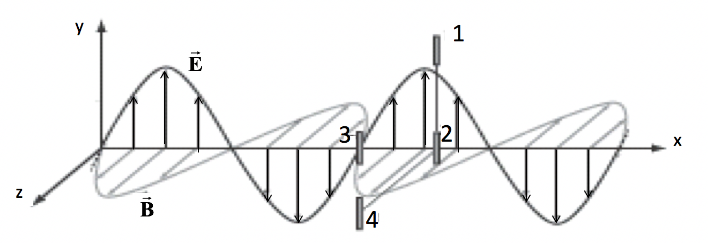
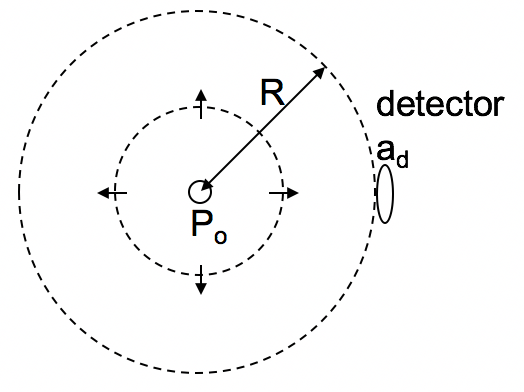

<section data-markdown>

The electric fields of two EM waves in vacuum are both described by:

$$\mathbf{E} = E_0 \sin(kx-\omega t)\hat{y}$$

The "wave number" $k$ of wave 1 is larger than that of wave 2, $k_1 > k_2$. Which wave has the larger frequency $f$?

1. Wave 1
2. Wave 2
3. impossible to tell

Note:
* Correct Answer: A
* Same speed and thus wavelength of 1 is smaller, so frequency is higher

</section>

<section data-markdown>
For a wave on a 1d string that hits a boundary between 2 strings of different material we get,

$$\widetilde{f}(z<0) = \widetilde{A}_I e^{i(k_1)z-\omega t} + \widetilde{A}_Re^{i(-k_1z-\omega t)}$$
$$\widetilde{f}(z>0) = \widetilde{A}_T e^{i(k_2)z-\omega t}$$

where continuity (BCs) give,

$$\widetilde{A}_R = \left(\dfrac{k_1-k_2}{k_1+k_2}\right)\widetilde{A}_I$$
$$\widetilde{A}_T = \left(\dfrac{2k_1}{k_1+k_2}\right)\widetilde{A}_I$$

Is the transmitted wave in phase with the incident wave?

A) Yes, always B) No, never C) Depends

Note:
* Correct answer: A

</section>

<section data-markdown>
For a wave on a 1d string that hits a boundary between 2 strings of different material we get,

$$\widetilde{f}(z<0) = \widetilde{A}_I e^{i(k_1)z-\omega t} + \widetilde{A}_Re^{i(-k_1z-\omega t)}$$
$$\widetilde{f}(z>0) = \widetilde{A}_T e^{i(k_2)z-\omega t}$$

where continuity (BCs) give,

$$\widetilde{A}_R = \left(\dfrac{k_1-k_2}{k_1+k_2}\right)\widetilde{A}_I$$
$$\widetilde{A}_T = \left(\dfrac{2k_1}{k_1+k_2}\right)\widetilde{A}_I$$

Is the reflected wave in phase with the incident wave?

A) Yes, always B) No, never C) Depends

Note:
* Correct answer: C
* Can be 180 out of phase

</section>

<section data-markdown>

An electromagnetic plane wave propagates to the right.  Four vertical antennas are labeled 1-4. 1, 2, and 3 lie in the $x-y$ plane.  1, 2, and 4 have the same $x$-coordinate, but antenna 4 is located further out in the $z$-direction.
Rank the time-averaged signals received by each antenna.

1. 1=2=3$>$4
2. 3$>$2$>$1=4
3. 1=2=4$>$3
4. 1=2=3=4
5. 3$>$1=2=4

Note:
* Correct Answer: D

</section>

<section data-markdown>

A point source of radiation emits power $P_0$ isotropically (uniformly in all directions).  A detector of area $a_d$ is located a distance $R$ away from the source.  What is the power $P_d$ received by the detector?

1. $\frac{P_0}{4\pi R^2}a_d$
2. $P_0\frac{a_d^2}{R^2}$
3. $P_0\frac{a_d}{R}$
4. $\frac{P_0}{\pi R^2}a_d$
5. None of these

Note:
* Correct Answer: A

</section>
