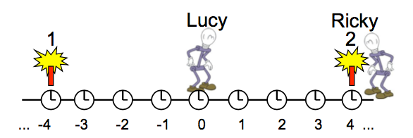
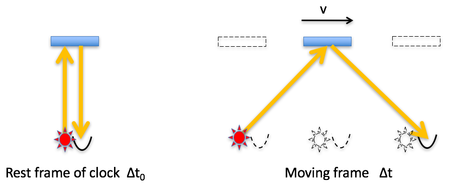

<section data-markdown>

The Galilean transformation between $S'$ and $S$ is:

$$x = x' + vt$$

The Lorentz transformation will introduce a $\gamma$, where do you think it goes? And why?

Note:
This is just to get them thinking. The time will dilate and the length with contract, so where does the gamma go? It ultimately multiples both.
</section>

<section data-markdown>

## Announcements
* Quiz 6 (Due next Monday)
  * Use special relativity to investigate the effects of particle detection
  * Compare two events observed from different frames
* Homework 12 (Due next Monday)
  * Will accept through Wednesday

</section>

<section data-markdown>

In the moving frame $K'$ (moving with velocity $+v$ in the $x$ direction), we make a measurement that an object is at a location $x_0'$, what is the location $x_0$ of the object in the rest frame $K$? Use the Galilean transformation for now.

1. $x_0 = x_0' + vt$
2. $x_0 = x_0' - vt$
3. I'm confused

_Hint: Yours truly got it wrong yesterday!_

Note:
* Correct Answer: A

</section>

<section data-markdown>

Two firecrackers explode. Lucy, halfway between the firecrackers, sees them explode at the same time. Ricky (same reference frame as Lucy) is next to firecracker 2. According to Ricky, which firecracker explodes first?

1. Both explode at the same time
2. Firecracker 1 explodes first
3. Firecracker 2 explodes first

*Hint: Separate what Ricky "sees" from what he would observe.*

Note:
* Correct Answer: A

</section>

<section data-markdown>

In which frame of reference is the time between tics of the clock **longer**?

1. Rest frame of clock
2. moving frame
3. no difference

Note:
* Correct Answer: B

</section>

<section data-markdown>

What is the **minimum** number of observers needed in the **rest frame** to measure the "tic"?

1. 1
2. 2
3. 3
4. More than 3
5. ???

Note:
* Correct Answer: A

</section>

<section data-markdown>

What is the **minimum** number of observers needed in the **moving frame** to measure the "tic"?

1. 1
2. 2
3. 3
4. More than 3
5. ???

Note:
* Correct Answer: B

</section>

<section data-markdown>

I have a stick of length $L$ sitting in front of me. In the reference frame of a passing train, (moving parallel to the stick) what is the measured length of the stick?

1. $L$
2. $\gamma L$
3. $L/\gamma$
4. I'm sure it's B or C, but not sure which one
5. It depends

Note:
* Correct Answer: C

</section>

<section data-markdown>

In particle decay the rate of decay is proportional to the number of particles left,

$$\dfrac{dN}{dt} = -\lambda N$$

If we start with $N_0$ particles, what's the fraction of remaining particles in a time $\Delta t$?

1. $N_0 e^{-\lambda \Delta t}$
2. $N_0 e^{+\lambda \Delta t}$
3. $N_0 e^{-\Delta t/\lambda}$
4. $N_0 e^{+\Delta t/\lambda}$
5. Something else

Note:
* Correct answer: E
* It's a fraction, so it's A without the number
</section>

<section data-markdown>

In a particle detection experiment, the fraction of particles detected is:

1. underestimated
2. overestimated
3. the same as

if we use the time of flight in the detector frame.

Note:
* Correct Answer: A

</section>

<section data-markdown>

In our particle detection experiment, the fraction of particles detected at a given location in detector frame will be:

$$e^{-\lambda \Delta t}$$

What is $\Delta t$ in this case?

1. The time to traverse from the source to the detector
2. The time observed on the clock on the wall
3. The time observed by the particles in their frame
4. None of these
5. More than one of these

Note:
* Correct answer: E? Definitely C, but could be A

</section>

<section data-markdown>

Is the time interval ($\Delta t$) between two events Lorentz invariant?

1. Yes
2. No

Note:
* Correct answer: B

</section>

<section data-markdown>

Is the proper time interval ($\Delta \tau = \dfrac{\Delta t}{\gamma}$) between two events Lorentz invariant?

1. Yes
2. No

Note:
* Correct answer: A

</section>

<section data-markdown>

I'm in frame $S$, and you are in is in Frame $S'$, which moves with speed $V$ in the $+x$ direction.

An object moves in the $S'$ frame in the $+x$ direction with speed $v'_x$.
Do I measure its $x$ component of velocity to be $v_x = v'_x$?

1. Yes
2. No
3. ???

Note:
* Correct Answer: B
* can't be. because of time dilation and length contraction

</section>

<section data-markdown>

I'm in frame $S$, and you are in is in Frame $S'$, which moves with speed $V$ in the $+x$ direction.

An object moves in the $S'$ frame in the $+y$ direction with speed $v'_y$.
Do I measure its $y$ component of velocity to be $v_y = v'_y$?

1. Yes
2. No
3. ???

Note:
* Correct Answer: B
* again. can't be. because of time dilation and length contraction

</section>
